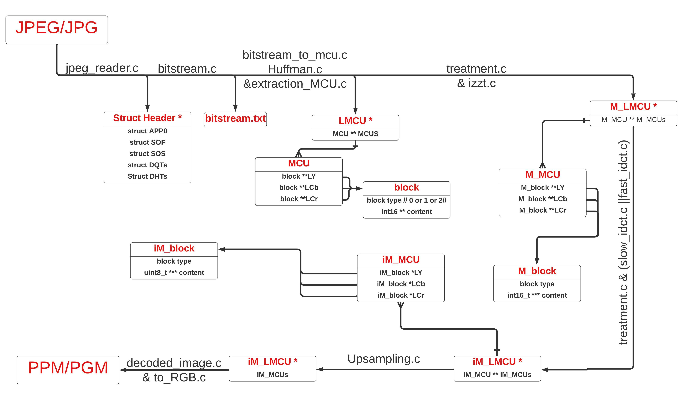

# JPEG Decoder 🖼️
  JPEG Decoder est un programme en C permettant de décoder des images JPEG/JPG en PPM ou PGM. Il implémente le décodage Huffman, l'inversion DCT et la conversion YCbCr-RGB pour reconstruire l'image.

## 🚀 Fonctionnalités
✅ Extraction des métadonnées JPEG (taille, composants, tables de quantification, Huffman)
✅ Décodage du bitstream et extraction des MCUs
✅ Reconstruction de l’image avec IDCT et conversion YCbCr → RGB
✅ Support des images en niveaux de gris (PGM) et en couleur (PPM)
✅ Gestion des différents facteurs d’échantillonnage

## 🛠️ Technologies utilisées
- Langage : C
- Format d’image : JPEG → PPM/PGM
- Compilation : Makefile
## 📁 Structure du projet
```bash
  JPEG-Decoder/
  ├── src/         # Code source (.c et .h)
  ├── include/     # Fichiers d'en-tête
  ├── images/      # Images de test
  ├── obj/         # Fichiers objets compilés (.o)
  ├── bin/         # Exécutables
  ├── README.md    # Documentation du projet
  └── Makefile     # Script de compilation
```
## 🔧 Installation et exécution
### 1️⃣ **Compilation**
```bash
  make
```
### 2️⃣ **Exécution**
```bash
  ./bin/jpeg2ppm <fichier.jpeg> <output.ppm>
```
## 📌 **Modules principaux**
- jpeg_reader.c : Extraction des métadonnées JPEG
- bitstream.c : Traitement du bitstream JPEG
- bitstream_to_mcu.c / extraction_mcu.c : Extraction des MCUs
- huffmann.c : Gestion des arbres Huffman
- treatment.c / izz.c : Inverse quantification et zigzag
- idct.c : Transformation IDCT
- upsample.c : Agrandissement des composantes couleur
- to_RGB.c : Conversion YCbCr → RGB
- decoded_image_creator.c : Génération de l’image PPM/PGM
## ✨ **Améliorations possibles**
- Optimisation de la gestion mémoire
- Support d’autres formats de sortie (BMP, PNG)
- Accélération avec SIMD/OpenMP
## 👥 **Équipe** : Mouez Jaafoura, Firas Khalfallah, Bassem Akrout


